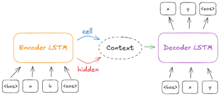
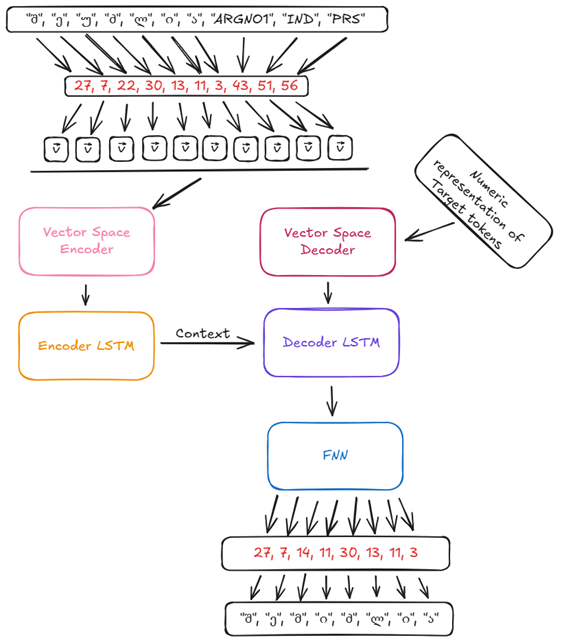
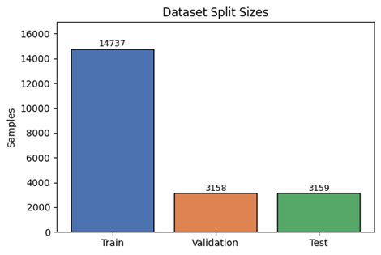

# GeoMorphVCM
This is the Georgian Morphological Verb Conjugator Model (GeoMorphVCM), a model that takes in the 3rd person singular present form + some grammatical tags of a Georgian verb and generates a desired different form from that same root. The motivation for developing such a model was that Georgian is a low-resource language with little material for learners to use. The extreme complexity of the verb system can overwhelm the beginner and even intermediate to advanced learner. Sadly, no easy-to-use conjugator exists as of now, at least to my knowledge. Thus, this model is supposed to be a first pilot project that aims to:
- Test foundational Deep Learning algorithms in the realm of Georgian verbs
- Use a basic model to justify the usage of more complex ones down the line
- Explore the limits of existing data on Georgian verbs
- Provide a base-line model to be built upon in potential later projects
- To power user-friendly didactical applications for second language acquisition

# Model Architecture
I am using encoder-decoder architecture as described by Cho et al. (2014) and Sutskever et al. (2014). The following shows a simplified visualization of the general architecture:

# The model

The model components consist of the preprocessed UniMorph Georgian dataset, embedding layers, the above mentioned architecture, an FNN layer, and the output in form of a fully conjugated verb. The full model is visualized as follows:

# Development
## Overview
The model was developed in 4 stages:
- Data exploration/cleaning
- Preprocessing
- Train-Val-Test Split
- Training

I used the UniMorph Georgian dataset that can be found under the following link: https://github.com/unimorph/kat.

 ## Data exploration/cleaning

 Luckily, the UniMorph dataset is a fantastically organised dataset. The only adjustments I needed to make were to filter for verbs, since it contains multiple parts of speech and fix a script related error. Rows 7602 − 8624 contain the latin character *-a* which I replaced with the Georgian *-ა* to ensure smooth processing.

 ## Preprocessing

 Here I prepare two dictionaries; one for the feature set and one for the target set. These serve the purpose of encoding the linguistic data into numeric representations to further be embedded and processed later. I decided to tokenize on a character basis. The obstacle here is that UniMorph does not readily provide a tokenizer for Georgian characters. So, I will use the mentioned dictionaries to seperate the characters and, in the case of the feature set, the grammatical tags. Then, I concatenate them in the same sequence, such that they are seperated character by character. Further, I added special tokens in form of <bos> (beggining-of-sequence), <eos> (end-of-sequence) and <pad> (padding). The structure looks as follows: 

 - featzure: <bos> შ, ე, უ, ძ, ლ, ი, ა ARGNO3, IND, PRS <eos>
 - target: <bos> შ, ე, მ, ი, ძ, ლ, ი, ა <eos>

## Train-Validation-Test-Split

I decided to integrate a validation loop to implement efficient and effective early-stopping methods. The split looks as follows:

## Training

I used a bi-directional LSTM for the encoder, and a vanilla LSTM for the decoder. The training parameters for the best model looked as follows:

| Hyperparams          | Values  |
| -------------------- | ------- |
| Epochs               | 200     |
| Batch size           | 64      |
| Learning rate        | 0.0001  |
| Hidden layer dims    | 32      |
| Embedding dims       | 100     |
| layers encoder       | 2       |
| layers decoder       | 1       |

## Results

With an accuracy of 93.98% for the train-set, 92.52% for the val-set, and 92.63% for the test-set, it is safe to assume that such an approach can help us develop ressource efficient second language acquisition applications for a low-ressource language like Georgian.
